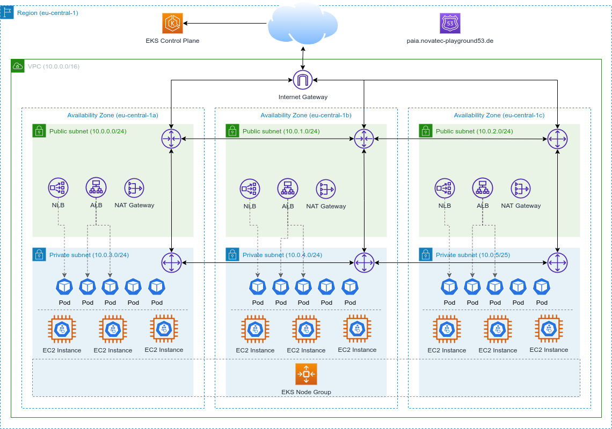

= TC P AIA Showcases Cloud

The goal of this repository is to demonstrate and evaluate cloud services and to provide an infrastructure for additional showcases.

*IMPORTANT*: Work is still in progress!

== Overview

*link:infrastructure/README.adoc[Infrastructures]*

* link:infrastructure/aws/README.adoc[AWS]

link:https://app.diagrams.net/#HNovatecConsulting%2Ftc-paia-showcases-cloud%2Fmain%2Finfrastructure%2Fshowcase-infrastructure.drawio.png[Edit, window=\"_blank\"]

*link:platform/README.adoc[Platforms]*

* link:platform/asyncapi/README.adoc[AsyncAPI]

== Prerequisites

Download and install the following tools:

* link:https://www.terraform.io/downloads[Terraform]
* link:https://kubernetes.io/docs/tasks/tools/[Kubectl]
* link:https://helm.sh/docs/intro/install/[Helm]
* link:https://docs.aws.amazon.com/cli/latest/userguide/getting-started-install.html[AWS CLI]

Configure the tools:

.Create AWS Cli profile
[source,bash]
----
aws configure --profile nt-playground
----